<div align="center">

# Acondicionamiento de señales de alta impedancia
### Simulación de un electrodo de pH con ESP32 y buffer JFET (TL084) vs. bipolar (LM324)

**Laboratorio N.º 1 · Instrumentación Biomédica III**<br>
Escuela Profesional de Ingeniería Biomédica · Facultad de Ingeniería Electrónica y Eléctrica<br>
**Universidad Nacional Mayor de San Marcos**


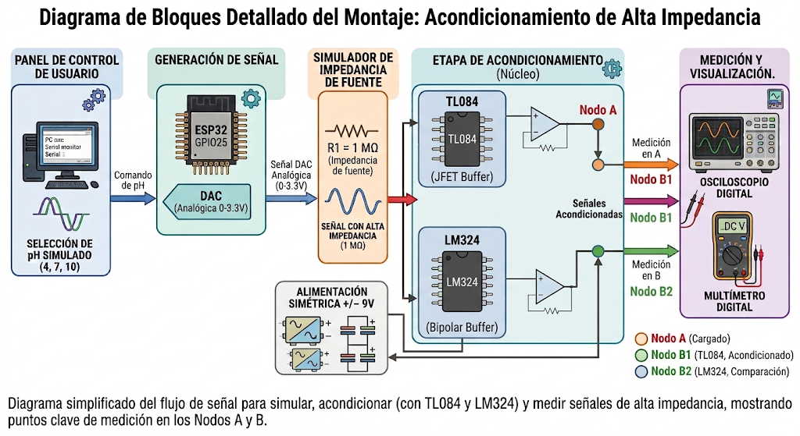

<sub>Diagrama de bloques: generación de pH simulado (ESP32) → alta impedancia (R1 = 1 MΩ) → buffer TL084 / LM324 → medición.</sub>

</div>

---

## Contenido

- [Descripción](#descripción)
- [Fundamento teórico](#fundamento-teórico)
- [Estructura del repositorio](#estructura-del-repositorio)
- [Materiales y equipos](#materiales-y-equipos)
- [Esquemático](#esquemático)
- [Cómo reproducir el experimento](#cómo-reproducir-el-experimento)
- [Resultados](#resultados)
- [Evidencia fotográfica](#evidencia-fotográfica)
- [Conclusiones](#conclusiones)
- [Referencias](#referencias)
- [Integrantes](#integrantes)

---

## Descripción

Un **electrodo de vidrio para pH** se comporta como una fuente de tensión con una resistencia interna de cientos de megaohmios. Si se conecta directamente a un instrumento, la impedancia de entrada de este forma un divisor de tensión y la lectura cae (**efecto de carga**).

En este laboratorio:

1. Un **ESP32** genera, mediante su DAC (GPIO25), el potencial de un electrodo de pH calculado con la **ecuación de Nernst** (pH 4, 7 y 10).
2. Una resistencia serie **R1 = 1 MΩ** emula la alta impedancia de la membrana y permite **observar el error de carga** (Nodo A).
3. Un **seguidor de tensión** con **TL084 (entrada JFET)** corrige el error, y se compara con un **LM324 (entrada bipolar)** (Nodo B).

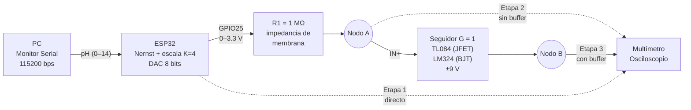

---

## Fundamento teórico

**Ecuación de Nernst (25 °C):**

$$E = E^{0} - \frac{2.303\,RT}{F}\,(pH - 7) \;\approx\; E^{0} - 0.05916\,(pH-7)\ \text{V}$$

**Señal generada por el firmware** (offset y escala para el rango del DAC):

$$V_{out} = 1.65\ \text{V} + K\cdot E(pH), \qquad K = 4$$

**Efecto de carga (divisor de tensión):**

$$V_{medido} = V_{fuente}\left(\frac{R_{in}}{R_s + R_{in}}\right)$$

**Error por corriente de polarización en el buffer:**

$$\Delta V_{bias} = I_{bias}\cdot R_s$$

| Op-amp | Entrada | $I_{bias}$ típica (25 °C) | $\Delta V$ sobre 1 MΩ |
|---|---|:--:|:--:|
| **TL084** | JFET | ≈ 65 pA (máx. 200 pA) | ≈ 0.065 mV |
| **LM324** | Bipolar PNP | ≈ 20 nA (máx. 250 nA) | ≈ 20 mV |

> El offset de 1.65 V no representa el potencial real del electrodo: un electrodo ideal produce ≈ 0 V a pH 7. Se usa solo para mantener la señal dentro de 0–3.3 V.

---

## Estructura del repositorio

```
lab1-acondicionamiento-alta-impedancia/
├── firmware/
│   └── simulador_ph_esp32/
│       └── simulador_ph_esp32.ino   ← código cargado en el ESP32
├── hardware/
│   ├── proteus/                     ← proyectos .pdsprj (Proteus 8)
│   └── esquematicos/                ← capturas PNG de cada etapa
├── data/                            ← tablas 1–3 en CSV + resultados
├── analysis/
│   ├── calculo_errores.py           ← cálculo de errores y gráfico
│   └── grafico_errores.png
├── docs/
│   ├── galeria.md                   ← todas las fotografías con leyenda
│   └── img/                         ← fotos por etapa y figuras
├── LICENSE
└── README.md
```

---

## Materiales y equipos

| Componente / equipo | Cant. | Modelo u observación |
|---|:--:|---|
| Microcontrolador | 1 | ESP32 DevKit V1 (DAC1 en GPIO25) |
| Amplificador operacional JFET | 1 | TL084 (Texas Instruments) |
| Amplificador operacional bipolar | 1 | LM324 (Texas Instruments) |
| Resistencia | 1 | 1 MΩ, ¼ W (simula la membrana de vidrio) |
| Capacitores cerámicos | 2 | 0.1 µF (desacoplo de V+ y V−) |
| Protoboard | 2 | 800 puntos |
| Jumpers | 10 | Macho–macho |
| Fuente de alimentación dual | 1 | SIGLENT SPD3303DC (±9 V) |
| Osciloscopio digital | 1 | ATTEN ADS1062CML (1 MΩ ∥ 17 pF) |
| Multímetro digital | 1 | PRASEK PR-301 (≈ 10 MΩ en VDC) |
| Multímetro de gancho | 1 | UNI-T UT204+ (≈ 10 MΩ en VDC) |
| Computador portátil | 1 | ASUS TUF Gaming, Linux (Arduino IDE) |

---

## Esquemático

<div align="center">
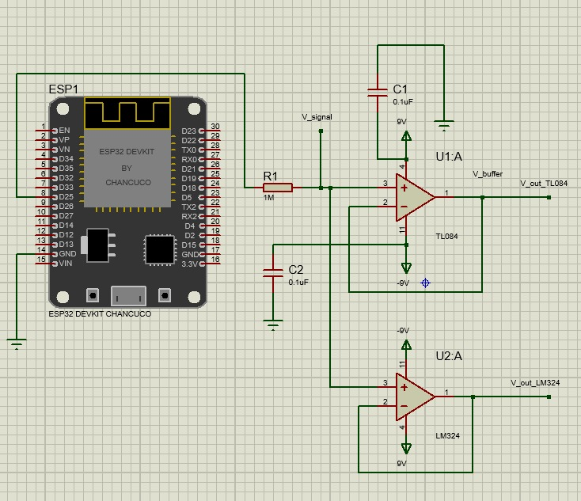

<sub>Circuito completo en Proteus: ESP32 → R1 = 1 MΩ → Nodo A → seguidores TL084 (U1:A) y LM324 (U2:A) alimentados con ±9 V.</sub>
</div>

Esquemáticos por etapa y conexiones pin a pin: [`hardware/README.md`](hardware/README.md).

---

## Cómo reproducir el experimento

<details open>
<summary><b>Etapa 1 — Verificar la señal generada</b></summary>

1. Cargar [`firmware/simulador_ph_esp32/simulador_ph_esp32.ino`](firmware/simulador_ph_esp32/simulador_ph_esp32.ino) en el ESP32 (ver [`firmware/README.md`](firmware/README.md)).
2. Abrir el Monitor Serial a **115200 baudios**, fin de línea **“Nueva línea”**.
3. Enviar `7`, `4` y `10`; medir GPIO25 contra GND con multímetro y osciloscopio (acople DC).
</details>

<details>
<summary><b>Etapa 2 — Observar el efecto de carga (sin buffer)</b></summary>

1. Intercalar **R1 = 1 MΩ** entre GPIO25 y el **Nodo A**.
2. Medir el Nodo A con el multímetro y, por separado, con el osciloscopio (punta en ×1).
3. Registrar los valores en `data/tabla2_nodoA_sin_buffer.csv`.
</details>

<details>
<summary><b>Etapa 3 — Corregir el error con el buffer</b></summary>

1. Alimentar el TL084: pin 4 → +9 V, pin 11 → −9 V, COM a GND común; 0.1 µF de cada riel a GND.
2. Nodo A → pin 3 (IN+); unir pin 1 (OUT) con pin 2 (IN−).
3. Medir el **Nodo B** (pin 1) para pH 4, 7 y 10.
4. Repetir con el LM324 (mismo pinout) y registrar en `data/tabla3_nodoB_con_buffer.csv`.
</details>

<details>
<summary><b>Análisis de datos</b></summary>

```bash
pip install pandas matplotlib
python analysis/calculo_errores.py
```
Genera `data/resultados_errores.csv` y `analysis/grafico_errores.png`.
</details>

---

## Resultados

### Tabla 1 — Voltaje en GPIO25 (Etapa 1)

| pH | V programado | Valor DAC | V verificado |
|:--:|:--:|:--:|:--:|
| 4 | 2.360 V | 182 | **2.29 V** |
| 7 | 1.650 V | 128 | **1.64 V** |
| 10 | 0.940 V | 73 | **0.97 V** |

### Tabla 2 — Nodo A sin buffer (Etapa 2)

| pH | Multímetro | Error | Osciloscopio | Error |
|:--:|:--:|:--:|:--:|:--:|
| 4 | 1.17 V | −48.91 % | 1.06 V | −53.71 % |
| 7 | 0.79 V | −51.83 % | 0.72 V | −56.10 % |
| 10 | 0.47 V | −51.55 % | 0.40 V | −58.76 % |

### Tabla 3 — Nodo B con buffer (Etapa 3)

| pH | TL084 | Error | LM324 | Error |
|:--:|:--:|:--:|:--:|:--:|
| 4 | 2.31 V | **+0.87 %** | 2.319 V | +1.27 % |
| 7 | 1.65 V | **+0.61 %** | 1.665 V | +1.52 % |
| 10 | 0.99 V | **+2.06 %** | 0.994 V | +2.47 % |

<div align="center">
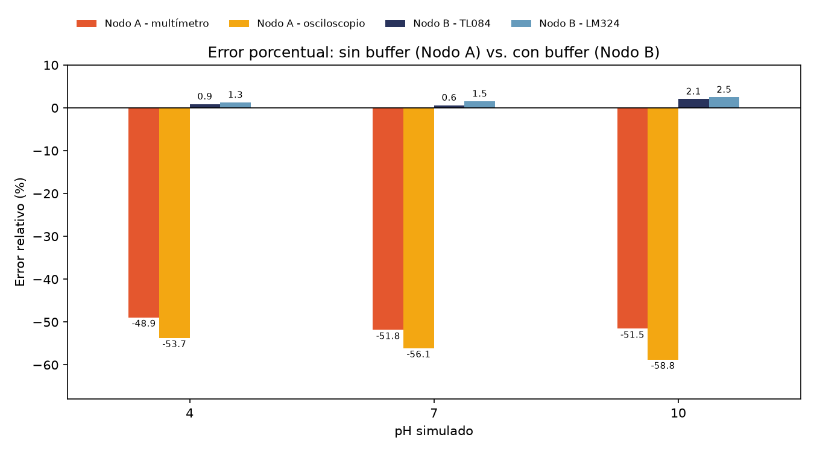

<sub>Error relativo: sin buffer la señal pierde ≈ 50 %; con el seguidor se recupera a menos de 2.5 %, con menor error en el TL084.</sub>
</div>

<table>
<tr>
<td align="center">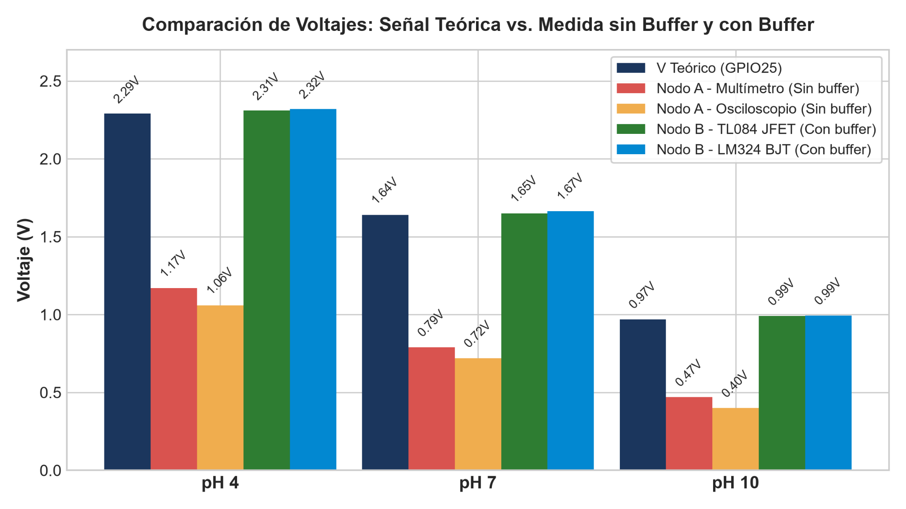<br><sub>Niveles de voltaje: teórico, Nodo A y Nodo B.</sub></td>
<td align="center">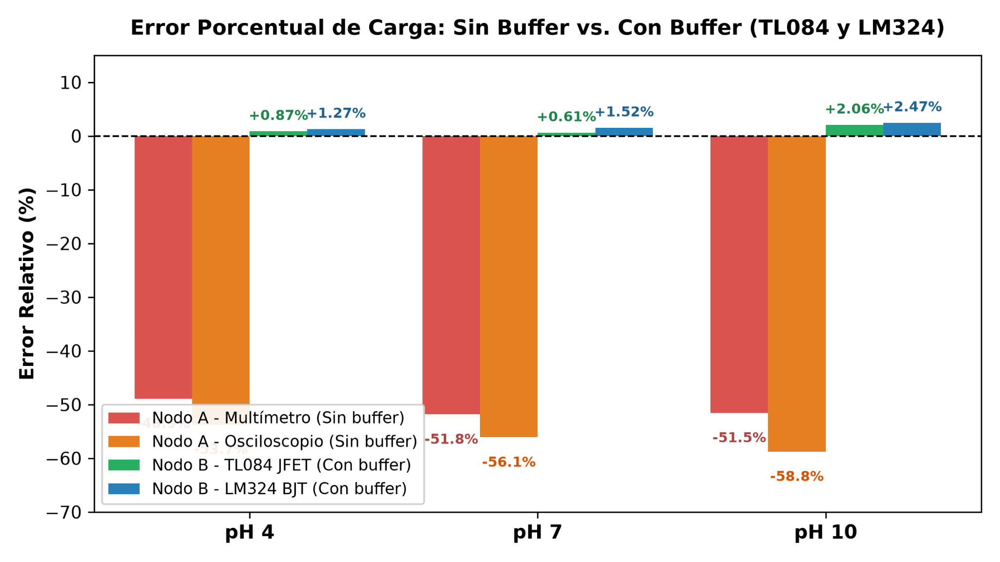<br><sub>Error relativo por etapa y por instrumento.</sub></td>
</tr>
</table>

---

## Evidencia fotográfica

<table>
<tr>
<td align="center" width="33%">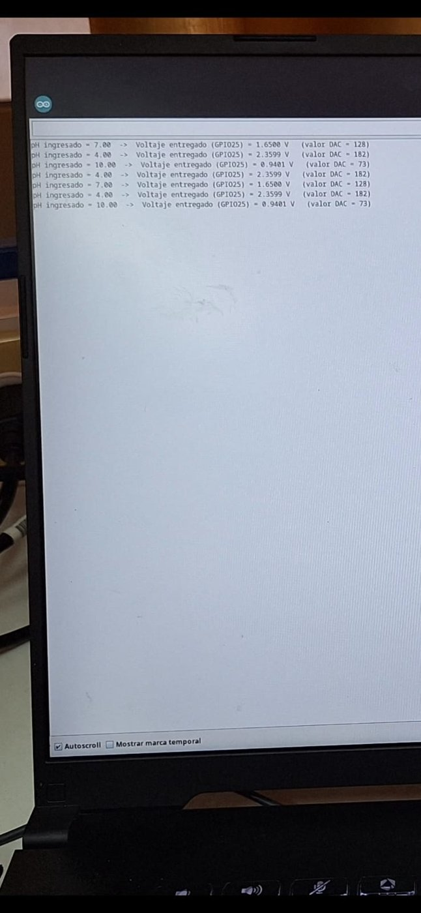<br><sub><b>Etapa 1</b> · Monitor Serial con pH 4, 7, 10 y valores DAC.</sub></td>
<td align="center" width="33%"><br><sub><b>Etapa 2</b> · R1 = 1 MΩ a la salida de GPIO25.</sub></td>
<td align="center" width="33%">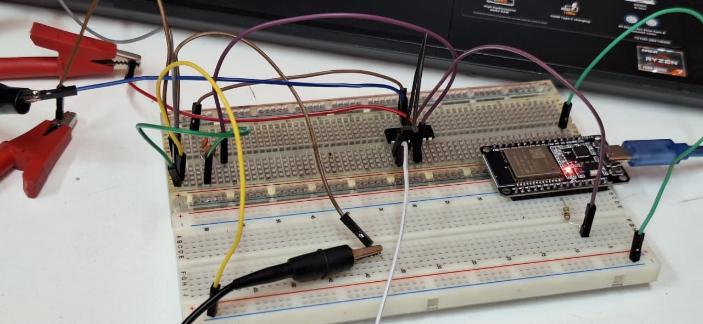<br><sub><b>Etapa 3</b> · Buffer TL084 con fuente ±9 V.</sub></td>
</tr>
<tr>
<td align="center">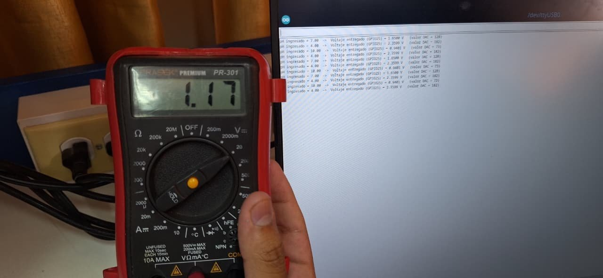<br><sub>Nodo A, pH 4: 1.17 V (carga).</sub></td>
<td align="center">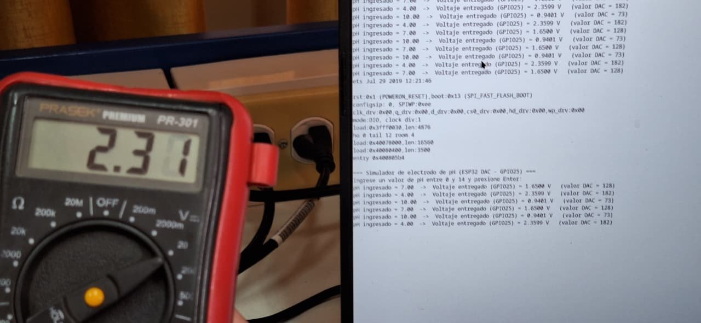<br><sub>Nodo B TL084, pH 4: 2.31 V.</sub></td>
<td align="center">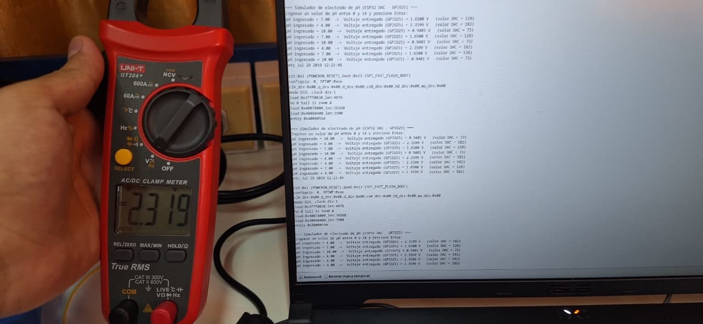<br><sub>Nodo B LM324, pH 4: 2.319 V.</sub></td>
</tr>
</table>

**Galería completa (32 figuras con leyenda):** [`docs/galeria.md`](docs/galeria.md)

---

## Conclusiones

- Conectar un instrumento de ≈ 1 MΩ a una fuente con 1 MΩ de resistencia interna **reduce la lectura a cerca de la mitad** (error de −49 % a −59 %), tal como predice el divisor de tensión.
- El osciloscopio (1 MΩ) carga más al nodo que el multímetro (≈ 10 MΩ), por eso su error fue mayor.
- El **seguidor de tensión** elimina el efecto de carga: el error baja a **< 2.5 %**.
- El **TL084 (JFET)** obtuvo errores menores que el **LM324 (bipolar)** en todos los puntos, por su corriente de polarización unas 1000 veces menor.
- Para un electrodo real (≈ 10⁸–10⁹ Ω) se recomiendan op-amps de grado electrómetro (fA), como LMC6001 o ADA4530-1.

---

## Referencias

1. Khandpur, R. S. (2014). *Handbook of Biomedical Instrumentation* (3.ª ed.). McGraw-Hill Education.
2. Webster, J. G., & Nimunkar, A. J. (2020). *Medical Instrumentation: Application and Design* (5.ª ed.). Wiley.
3. Sedra, A. S., & Smith, K. C. (2020). *Microelectronic Circuits* (8.ª ed.). Oxford University Press.
4. Texas Instruments. (2025). *TL08xx FET-Input Operational Amplifiers* (Rev. O). https://www.ti.com/lit/ds/symlink/tl084.pdf
5. Texas Instruments. (2025). *LMx24, LMx24x, LMx24xx and LM2902 Quadruple Operational Amplifiers* (Rev. AE). https://www.ti.com/lit/ds/symlink/lm324.pdf
6. Mettler-Toledo. (s. f.). *A Guide to pH Measurement*. https://www.mt.com/dam/LabDiv/Campaigns/testing_labs_2014/downloads/ph_conductivity_guide_EN.pdf
7. Espressif Systems. *ESP32 Arduino Core — DAC API*. https://docs.espressif.com/projects/arduino-esp32/en/latest/api/dac.html

---

## Integrantes

**Grupo 2 · L12 — Grupo par** · Docente: **Mg. María Elisia Armas Alvarado**

| Integrante |
|---|
| Aguilar Anamaria, Samuel Alessandro |
| Fernández Cuevas, Jesús Alberto |
| Laurente Caldas, Gabriel Alexander |
| Mora Zeña, Axel Tadeo Uriel |
| Pantoja Iturrizaga, Diego Felipe |

<div align="center"><sub>UNMSM · Instrumentación Biomédica III · 2026 · Licencia MIT</sub></div>
