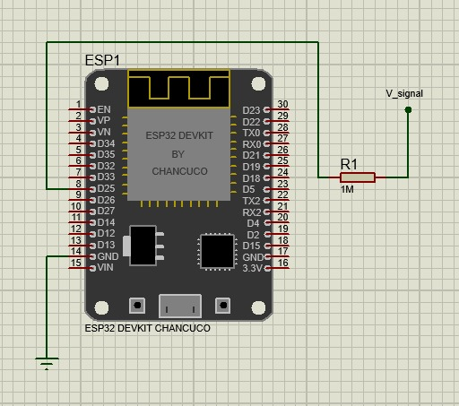
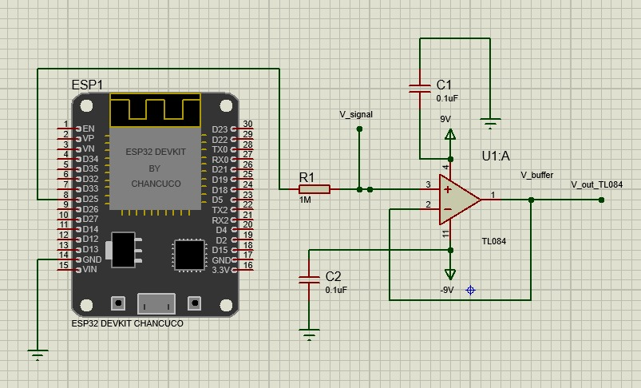
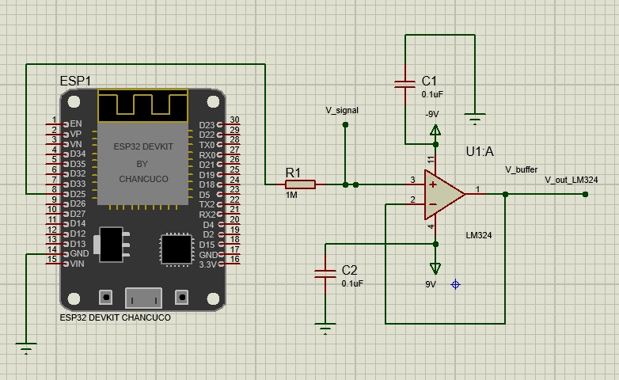

# Hardware — Esquemáticos y proyectos Proteus

Los archivos `.pdsprj` se abren con **Proteus 8 Professional** (Labcenter Electronics).

| Archivo | Etapa | Contenido |
|---|---|---|
| `proteus/Labo_1-Ckto_Part_1-IB_III.pdsprj` | Etapa 2 | ESP32 (GPIO25) + R1 = 1 MΩ → Nodo A (`V_signal`). |
| `proteus/Labo_1-Ckto_Part_2-IB_III.pdsprj` | Etapa 3a | Seguidor de tensión con **TL084** (U1:A), ±9 V y desacoplo 0.1 µF. |
| `proteus/Labo_1-Ckto_Part_3-IB_III.pdsprj` | Etapa 3b | Seguidor de tensión con **LM324** (U1:A), ±9 V y desacoplo 0.1 µF. |
| `proteus/Labo_1-Ckto_Final-IB_III.pdsprj` | Completo | Nodo A conectado en paralelo a ambos seguidores (TL084 y LM324). |

## Vista previa

| Etapa 2 — R1 = 1 MΩ | Etapa 3 — Buffer TL084 |
|:--:|:--:|
|  |  |
| **Etapa 3 — Buffer LM324** | **Circuito final** |
|  |  |

## Conexiones clave (DIP-14, TL084 / LM324)

| Pin | Función | Conexión |
|:--:|---|---|
| 3 | IN1+ | Nodo A (después de R1) |
| 2 | IN1− | Unido al pin 1 (realimentación total, G = 1) |
| 1 | OUT1 | Nodo B → instrumento |
| 4 | V+ | +9 V · 0.1 µF a GND |
| 11 | V− | −9 V · 0.1 µF a GND |

GND del ESP32, COM de la fuente dual y tierra de los instrumentos deben estar unidos.
